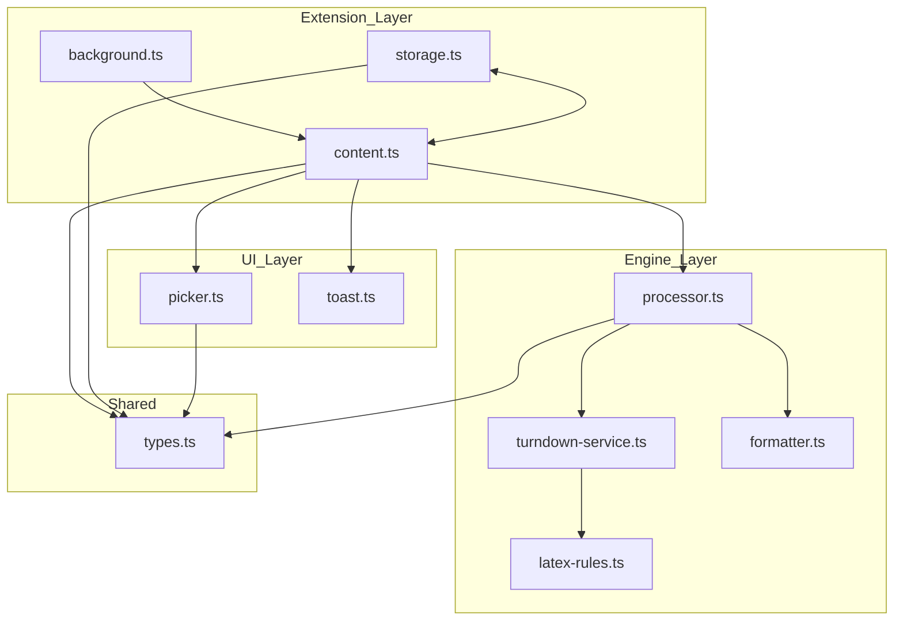

# Architecture Overview: Precision Markdown Saver

## Design Philosophy

**Local-First, Zero-Framework Obsidian Bridge**

This extension is a high-performance utility for transforming web DOM trees into Obsidian-flavored Markdown. It prioritizes structural integrity and mathematical notation over visual styling.

- **Performance**: Zero-framework (No React/Vue) to ensure instant execution on click.
- **Structural Mapping**: Uses a recursive tree-traversal algorithm that aligns the DOM hierarchy with a user-defined configuration tree.
- **Obsidian Optimized**: Native support for `${ ... }$` LaTeX and GFM (GitHub Flavored Markdown).
- **Stateless Logic**: The core transformation engine is decoupled from Browser APIs to allow for rigorous unit testing.

## Layered Architecture

### Layer 1: Extension Runtime (Background)
**File:** `src/background.ts`
- **Role**: The extension's permanent orchestrator.
- **Responsibilities**:
    - Listens for `chrome.action.onClicked` (The "One-Click" trigger).
    - Manages the Context Menu ("Configure Export", "Reset Site Rules").
    - Dispatches messages to the active tab's Content Script.

### Layer 2: Processing Engine (Stateless Logic)
**Directory:** `src/engine/`
Pure TypeScript logic that operates on DOM clones. This layer is strictly decoupled from `chrome.*` APIs.

#### `processor.ts` (The Recursive Walker)
- **Algorithm**: Recursively walks the DOM tree alongside the `ExportNode` configuration tree.
- **Entry Point**: `processElement(el: HTMLElement, config: ExportNode): string`
- **Logic**: 
    1. **Ignore**: If `action === 'ignore'`, returns empty string (element is excluded).
    2. **Template**: If `action === 'template'`, extracts text content and applies template transformation.
    3. **Include**: If `action === 'include'`:
        - **No children**: Lets Turndown handle the entire subtree as-is.
        - **With children**: Processes child rules recursively, removes matched elements from DOM clone, then converts remaining content via Turndown.
- **Key Features**:
    - Clones DOM before processing to avoid side effects.
    - Each matched element is processed exactly once (prevents duplication).
    - Supports nested rules (e.g., parent `include` with child `ignore` or `template`).
    - Template rules override default Turndown processing for specific elements.
- **TODO**: Implement content-density heuristics for auto-detection if no profile exists.

#### `turndown-service.ts`
- **Role**: Singleton instance of Turndown.js.
- **Config**: GFM enabled; keeps `` tags as remote `src` links.
- **LaTeX Integration**: Injects custom rules from `latex-rules.ts`.

#### `latex-rules.ts`
- **Role**: Specialized parsers for KaTeX and MathJax.
- **Output**: Wraps extracted TeX in `${ ... }$` for inline and $${ ... }$$ for blocks.
- **Logic**: Prioritizes extraction from `<annotation>` or `<script type="math/tex">` tags to ensure 100% formula accuracy.

#### `formatter.ts`
- **Role**: Handles string interpolation for custom templates.
- **Variables**: Supports `{{content}}`. 
- **TODO**: Add support for `{{href}}`, `{{src}}`, and `{{title}}`.

### Layer 3: UI Layer (Injected Interaction)
**Directory:** `src/ui/`
Simplistic Vanilla TS components injected into the web page.

#### `picker.ts` (AdBlock-Style Selector)
- **Visuals**: A high-z-index SVG/Div overlay for element highlighting.
- **Selector Logic**: Generates stable CSS selectors (ID > Unique Class > Tag Path).
- **Action Menu**: A floating micro-menu appearing on click:
    - **Include**: Set as main content or override an ignored parent.
    - **Ignore**: Exclude from export.
    - **Configure Template**: Define a custom Markdown wrapper.

#### `toast.ts`
- **Role**: Provides immediate feedback (e.g., "Copied to Clipboard").
- **Implementation**: Minimalist DOM element with a 3-second lifecycle.

### Layer 4: Extension Bridge (Orchestrator)
**File:** `src/content.ts`
The entry point within the web page context.

- **State Management**: Fetches/Saves `SiteProfile` via `storage.ts`.
- **Clipboard**: Executes `navigator.clipboard.writeText` after the engine finishes.
- **Coordination**: Connects the Background trigger to the Engine and UI layers.

## Data Model

### Core Type: `ExportNode` (Recursive Tree)
The configuration is stored as a tree that mirrors the parts of the DOM the user cares about.

```typescript
export interface ExportNode {
  id: string;                 // Internal UUID
  selector: string;           // CSS selector
  action: 'include' | 'ignore' | 'template';
  template?: string;          // e.g., "> [!info] {{content}}"
  children: ExportNode[];     // Nested overrides/rules
}

export interface SiteProfile {
  domain: string;             // URL Prefix/Hostname
  root: ExportNode;           // Usually starts at 'body' or 'article'
}
```

## Implementation Workflow

### 1. Build & Installation
- **Stack**: `pnpm` + `Vite` + `TypeScript`.
- **Installation**: 
    1. `pnpm build` (outputs to `/dist`).
    2. Load `/dist` as an unpacked extension in `chrome://extensions`.
- **Dev Loop**: `pnpm watch` for auto-rebuilds; refresh the target tab to update Content Script logic.

### 2. Processing Pipeline (The "One-Click" Flow)
1. **Trigger**: User clicks the extension icon.
2. **Fetch**: `content.ts` retrieves the `SiteProfile` for the current domain.
3. **Clone**: The DOM is cloned to prevent UI flickering or layout shifts.
4. **Walk**: `processor.ts` traverses the clone using the `SiteProfile` tree.
5. **Convert**: Turndown processes the resulting cleaned HTML.
6. **Copy**: The final Markdown string is sent to the system clipboard.
7. **Notify**: `toast.ts` displays a success message.

### 3. Unit Testing Strategy
- **Engine Tests**: Use `vitest` + `jsdom` to verify that specific HTML structures + `ExportNode` configs result in the expected Markdown.
- **Selector Tests**: Verify the picker generates valid selectors for complex nested elements.
- **LaTeX Tests**: Ensure formulas are correctly extracted from various site implementations (Wikipedia, StackOverflow, etc.).

## Module Dependencies



**Dependency Constraints:**
- `engine/` must remain **stateless** and **DOM-agnostic** (operates on passed elements only).
- `ui/` must not call `chrome.*` APIs directly (use callbacks or events).
- `shared/` contains only interfaces and constants.
