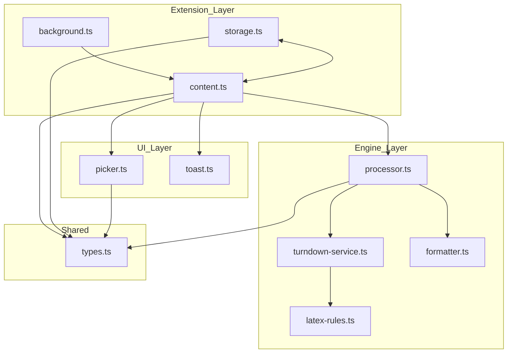

# Architecture Overview: Precision Markdown Saver

## Design Philosophy

**Local-First, Zero-Framework Obsidian Bridge**

This extension is a high-performance utility for transforming web DOM trees into Obsidian-flavored Markdown. It prioritizes structural integrity and mathematical notation over visual styling.

- **Performance**: Zero-framework (No React/Vue) to ensure instant execution on click.
- **Structural Mapping**: Uses a recursive tree-traversal algorithm that aligns the DOM hierarchy with a user-defined configuration tree.
- **Obsidian Optimized**: Native support for `${ ... }$` LaTeX and GFM (GitHub Flavored Markdown).
- **Stateless Logic**: The core transformation engine is decoupled from Browser APIs to allow for rigorous unit testing.

## Layered Architecture

### Layer 1: Extension Runtime (Background)
**File:** `src/background.ts`
- **Role**: The extension's permanent orchestrator.
- **Responsibilities**:
    - Listens for `chrome.action.onClicked` (The "One-Click" trigger).
    - Manages the Context Menu:
        - "Configure Export" - Activates picker mode on current page
        - "Open Configuration Editor" - Opens JSON editor in new tab
    - Dispatches messages to the active tab's Content Script.

### Layer 2: Processing Engine (Stateless Logic)
**Directory:** `src/engine/`
Pure TypeScript logic that operates on DOM clones. This layer is strictly decoupled from `chrome.*` APIs.

#### `processor.ts` (The Recursive Walker)
- **Algorithm**: Recursively walks the DOM tree alongside the `ExportNode` configuration tree.
- **Entry Point**: `processElement(el: HTMLElement, config: ExportNode): string`
- **Logic**: 
    1. **Ignore**: If `action === 'ignore'`, returns empty string (element is excluded).
    2. **Template**: If `action === 'template'`, extracts text content and applies template transformation.
    3. **Include**: If `action === 'include'`:
        - **No children**: 
            - If element is an iframe, drills into its `contentDocument.body` for same-origin iframes
            - Otherwise clones element, strips all `<script>` tags and their content, lets Turndown handle the entire subtree
        - **With children**: Processes child rules recursively via `resolveElementsInContext()` which supports iframe drilling, removes matched elements from DOM clone, then converts remaining content via Turndown.
- **Key Features**:
    - Clones DOM before processing to avoid side effects.
    - **Security**: Automatically removes all `<script>` tags and their content to prevent JavaScript code from appearing in markdown.
    - Each matched element is processed exactly once (prevents duplication).
    - Supports nested rules (e.g., parent `include` with child `ignore` or `template`).
    - Template rules override default Turndown processing for specific elements.
    - **Iframe Drilling**: `resolveElementsInContext()` supports `>>>` syntax for drilling into same-origin iframes in child selectors.
- **TODO**: Implement content-density heuristics for auto-detection if no profile exists.

#### `turndown-service.ts`
- **Role**: Singleton instance of Turndown.js.
- **Config**: GFM enabled; keeps `` tags as remote `src` links.
- **LaTeX Integration**: Injects custom rules from `latex-rules.ts`.
- **Table Preprocessing**: Unwraps paragraph and div elements inside table cells before Turndown converts the DOM, keeping cell content on one Markdown table row.

#### `latex-rules.ts`
- **Role**: Specialized parsers for KaTeX and MathJax.
- **Output**: Wraps extracted TeX in `${ ... }$` for inline and $${ ... }$$ for blocks.
- **Logic**: Prioritizes extraction from `<annotation>` or `<script type="math/tex">` tags to ensure 100% formula accuracy.

#### `formatter.ts`
- **Role**: Handles string interpolation for custom templates.
- **Variables**: Supports `{{content}}`. 
- **TODO**: Add support for `{{href}}`, `{{src}}`, and `{{title}}`.

### Layer 3: UI Layer (Injected Interaction)
**Directory:** `src/ui/`
Simplistic Vanilla TS components injected into the web page.

#### `picker.ts` (Text Input Selector UI)
- **Role**: Provides a text-based CSS selector input interface with visual feedback and multiple root management.
- **Components**: Manages input panel, highlighter, root list display, and action menu.
- **UI**: Fixed panel at top center with:
    - List of existing roots (clickable boxes with hover highlighting)
    - Remove button (x) for each root
    - Separator
    - Text input for adding new root CSS selectors
- **Features**:
    - Real-time element highlighting as user types selector
    - Status indicator showing number of matched elements
    - Support for iframe drilling with `>>>` syntax (e.g., `iframe#doc >>> article`)
    - Validates selectors and shows error messages
    - Highlights first matched element if multiple matches
- **Actions**: Include, Ignore, Template buttons for new roots.
- **Control Buttons**: Done (saves and closes), Cancel (discards and closes).
- **Callbacks**: Provides `onNodeCreated`, `onNodeRemoved`, `onComplete`, and `onCancel` hooks.
- **Keyboard**: Enter to confirm current selector, ESC to cancel.
- **Use Case**: Configure sites with content split across multiple containers or iframes (e.g., course heading + iframe content).

#### `selector-gen.ts` (CSS Selector Generator)
- **Strategy**: Generates stable CSS selectors with priority: ID > Unique Class > nth-of-type path.
- **Validation**: `validateSelector()` ensures the selector uniquely identifies the target element.
- **Labeling**: `generateElementLabel()` creates human-readable element descriptions.
- **Features**: Excludes picker-specific classes, handles special characters via `CSS.escape()`.

#### `highlighter.ts` (Visual Overlay & Iframe Drilling)
- **Implementation**: A positioned `div` overlay that highlights selected elements.
- **Styling**: Customizable border color, width, and background transparency.
- **Performance**: Smooth transitions with CSS transitions.
- **Iframe Drilling**: `resolveElements()` supports drilling into same-origin iframes using `>>>` separator syntax:
    - Simple selector: `".main-content"` → queries document normally
    - Iframe drilling: `"iframe#doc >>> article"` → finds iframe, accesses its contentDocument, queries inside
    - Handles multiple iframes and cross-origin gracefully (empty result for blocked iframes)
- **Use Case**: Enables export of content embedded in same-origin iframes (e.g., documentation sites, course platforms).

#### `picker-menu.ts` (Action Menu)
- **Actions**: Include, Ignore, Template, Cancel buttons.
- **Positioning**: Auto-adjusts to stay within viewport bounds.
- **Styling**: Modern, clean UI with hover states.
- **Template Input**: `promptForTemplate()` helper for user input.

#### `toast.ts`
- **Role**: Provides immediate feedback (e.g., "Copied to Clipboard").
- **Implementation**: Minimalist DOM element with a 3-second lifecycle.

### Layer 4: Configuration Management

#### `config.ts` + `config.html` (Configuration Editor)
- **Role**: Standalone JSON editor for managing all site profiles.
- **Access**: Opens in new tab via context menu "Open Configuration Editor".
- **Features**:
  - Direct JSON editing with validation
  - Import/Export configuration files
  - Minimal dark theme, monospace editor
  - Real-time validation on save
  - No complex UI or styling - just a textarea and buttons
- **Use Case**: Power users who prefer direct JSON editing over visual picker.

### Layer 5: Extension Bridge (Orchestrator)
**File:** `src/content.ts`
The entry point within the web page context.

- **State Management**: Fetches/Saves `SiteProfile` via `storage.ts`.
- **Clipboard**: Executes `navigator.clipboard.writeText` after the engine finishes.
- **Coordination**: Connects the Background trigger to the Engine and UI layers.
- **Message Handling**: Listens for `EXPORT_PAGE` and `CONFIGURE_SITE` messages from the background script.
- **Profile Resolution**: Retrieves the site profile for the current domain, falls back to full-page export if no profile exists.
- **SPA Support**: Monitors for React/Vue/Angular client-side navigation and waits for content to be ready before export.
- **Content Readiness**: Uses polling + MutationObserver to detect when dynamically loaded content is ready.
- **Error Handling**: Displays error toasts if profile root element is not found or export fails.
- **Regression Diagnostics**: Logs each exported root as a copyable JSON regression fixture.

### Layer 6: Utility Layer
**Directory:** `src/utils/`
Helper utilities for cross-cutting concerns.

#### `dom-ready.ts` (Content Readiness Detection)
- **waitForContent()**: Polls for meaningful content (text nodes, length thresholds) with timeout.
- **waitForSelector()**: Waits for a specific CSS selector to appear in the DOM.
- **observeContentReady()**: Uses MutationObserver to detect content changes efficiently.
- **Use Case**: Handles React/Vue/Angular apps that render content asynchronously after page load.

#### `spa-monitor.ts` (Single-Page Application Support)
- **SPAMonitor class**: Detects client-side navigation in React Router, Vue Router, Next.js, etc.
- **Detection Methods**:
  - URL polling (checks `window.location.href` every 500ms)
  - History API interception (`pushState`, `replaceState`, `popstate`)
  - MutationObserver (debounced DOM change detection)
- **waitForContentWithRetry()**: Aggressive polling with multiple retries to ensure content stability.
- **Heuristics**: Checks for loading indicators, text length, and semantic elements (p, article, h1-h6).
- **Use Case**: Ensures export works correctly after user navigates within a SPA without page reload.

## Data Model

### Core Type: `ExportNode` (Recursive Tree)
The configuration is stored as a tree that mirrors the parts of the DOM the user cares about.

```typescript
export interface ExportNode {
  id: string;                 // Internal UUID
  selector: string;           // CSS selector
  action: 'include' | 'ignore' | 'template';
  template?: string;          // e.g., "> [!info] {{content}}"
  children: ExportNode[];     // Nested overrides/rules
}

export interface SiteProfile {
  domain: string;             // URL Prefix/Hostname
  roots: ExportNode[];        // Multiple independent roots (e.g., heading + iframe content)
  updatedAt: number;          // Last updated timestamp
}
```

## React/SPA Compatibility

### The Challenge
Modern web applications (React, Vue, Angular, Next.js) render content asynchronously:
- **Initial HTML**: Often just `<div id="root"></div>` or similar
- **Content Appears Later**: JavaScript fetches data and renders components after page load
- **Client-Side Navigation**: URL changes without page reload (React Router, Vue Router)
- **Dynamic Selectors**: CSS modules and styled-components generate random class names

### Our Solution

#### 1. Content Readiness Detection (`dom-ready.ts`)
**Problem**: Extension activates before React finishes rendering.
**Solution**: 
- Poll for meaningful content (text nodes, length, semantic elements)
- Check every 100-200ms with configurable timeout (5-10 seconds)
- Require multiple consecutive positive checks (reduces false positives)
- Heuristics detect loading indicators and skeleton screens

#### 2. SPA Navigation Monitoring (`spa-monitor.ts`)
**Problem**: User navigates within SPA, profile selectors become stale.
**Solution**:
- **URL Polling**: Check `window.location.href` every 500ms
- **History API Interception**: Hook into `pushState`, `replaceState`, `popstate`
- **MutationObserver**: Detect DOM changes (debounced to avoid performance impact)
- **Auto Re-validation**: When navigation detected, reset content readiness and re-check

#### 3. Retry Logic
**Problem**: Content may appear in waves (skeleton → partial → complete).
**Solution**:
- `waitForContentWithRetry()` requires 3 consecutive successful checks
- If first export attempt fails to find selector, wait 5s and retry
- User sees informative toasts ("Waiting for page content...")

#### 4. Best Practices for Users
- **Wait for Content**: Let the page fully load before clicking export
- **Reconfigure After Navigation**: If URL structure changes, reconfigure the site
- **Use Stable Selectors**: When possible, configure using semantic HTML or data attributes, not generated class names

### Edge Cases Handled
- ✅ React 18+ concurrent rendering
- ✅ Next.js server-side rendering + hydration
- ✅ Infinite scroll / lazy loading (exports visible content)
- ✅ Client-side routing (React Router, Vue Router)
- ⚠️ CSS modules with random classes (may need reconfiguration after deploys)
- ⚠️ Shadow DOM (not currently supported)

## Implementation Workflow

### 1. Build & Installation
- **Stack**: `pnpm` + `Vite` + `TypeScript`.
- **Installation**: 
    1. `pnpm build` (outputs to `/dist`).
    2. Load `/dist` as an unpacked extension in `chrome://extensions`.
- **Dev Loop**: `pnpm watch` for auto-rebuilds; refresh the target tab to update Content Script logic.

### 2. Processing Pipeline (The "One-Click" Flow)
1. **Trigger**: User clicks the extension icon.
2. **Fetch**: `content.ts` retrieves the `SiteProfile` for the current domain.
3. **Clone**: The DOM is cloned to prevent UI flickering or layout shifts.
4. **Walk**: `processor.ts` traverses the clone using the `SiteProfile` tree.
5. **Convert**: Turndown processes the resulting cleaned HTML.
6. **Copy**: The final Markdown string is sent to the system clipboard.
7. **Notify**: `toast.ts` displays a success message.

### 3. Unit Testing Strategy
- **Engine Tests**: Use `vitest` + `jsdom` to verify that specific HTML structures + `ExportNode` configs result in the expected Markdown.
- **Selector Tests**: Verify the picker generates valid selectors for complex nested elements.
- **LaTeX Tests**: Ensure formulas are correctly extracted from various site implementations (Wikipedia, StackOverflow, etc.).

## Module Dependencies



**Dependency Constraints:**
- `engine/` must remain **stateless** and **DOM-agnostic** (operates on passed elements only).
- `ui/` must not call `chrome.*` APIs directly (use callbacks or events).
- `shared/` contains only interfaces and constants.
